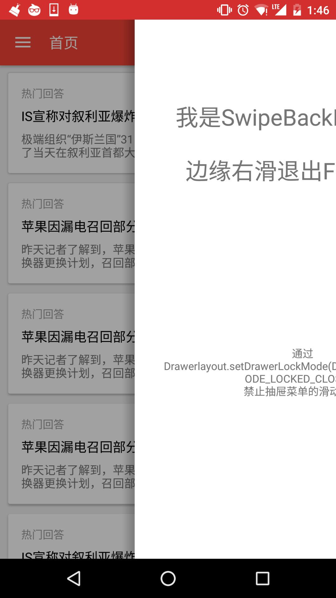

# 简介
滑动Activity/Fragment边缘即可类似IOS一样，拖动返回。

Activity内Fragment数大于1时，滑动返回的是Fragment，否则滑动返回的是Activity。

# 截图


# 如何使用
1、项目下app的build.gradle中依赖：
````gradle
// appcompat v7包是必须的
compile 'me.yokeyword:fragmentation-swipeback:0.1.1'
````
2、如果Activity也需要支持SwipeBack，则继承SwipeBackActivity:
````java
public class SwipeBackSampleActivity extends SwipeBackActivity {}
````
同时该Activity的theme添加如下属性：
````xml
 <item name="android:windowIsTranslucent">true</item>
````

3、如果Fragment需要支持SwipeBack，则继承SwipeBackFragment:
````java
public class SwipeBackSampleFragment extends SwipeBackFragment {
 @Override
    public View onCreateView(LayoutInflater inflater, ViewGroup container, Bundle savedInstanceState) {
        View view = inflater.inflate(R.layout.xxx, container, false);
        // 需要支持SwipeBack则这里必须调用toSwipeBackFragment(view);
        return toSwipeBackFragment(view);
    }
}
````
