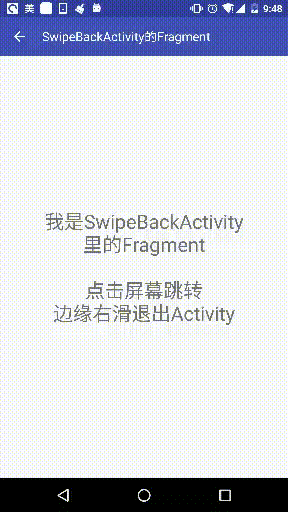

# 简介
滑动Activity/Fragment边缘即可类似IOS一样，拖动返回。

Activity内Fragment数大于1时，滑动返回的是Fragment，否则滑动返回的是Activity。

# 截图


# 如何使用
### 注意：以下为androidx的使用方式，如果使用的是android.support包，[点击这里](https://github.com/YoKeyword/Fragmentation/blob/master/fragmentation_swipeback/README.md)
1、项目下app的build.gradle中依赖：
````gradle
implementation 'me.yokeyword:fragmentationx:1.0.1'
implementation 'me.yokeyword:fragmentationx-swipeback:1.0.1'
````

2、如果Activity也需要支持SwipeBack，则继承SwipeBackActivity:
````java
// 1.0.0起，SwipeBackActivity，可以自行通过实现＋委托形式 实现自己SupportActivity，再实现SwipeBackActivity
public class SwipeBackSampleActivity extends SwipeBackActivity {}
````
同时该Activity的theme添加如下属性：
````xml
 <item name="android:windowIsTranslucent">true</item>
````

3、如果Fragment需要支持SwipeBack，则继承SwipeBackFragment:
````java
// 1.0.0起，不强制要求继承SwipeBackFragment，可以自行通过实现＋委托形式 实现自己的SupportFragment，再实现SwipeBackFragment
public class SwipeBackSampleFragment extends SwipeBackFragment {
 @Override
    public View onCreateView(LayoutInflater inflater, ViewGroup container, Bundle savedInstanceState) {
        View view = inflater.inflate(R.layout.xxx, container, false);
        // 需要支持SwipeBack则这里必须调用toSwipeBackFragment(view);
        return attachToSwipeBack(view);
    }
}
````

更多方法:
````java
  getSwipeBackLayout().setEdgeOrientation(SwipeBackLayout.EDGE_RIGHT); // EDGE_LEFT(默认),EDGE_ALL

  getSwipeBackLayout().setParallaxOffset(0.0f ~ 1.0f); // （类iOS）滑动退出视觉差，默认0.3

  setSwipeBackEnable(boolean enable); // 是否允许滑动

  getSwipeBackLayout().setSwipeAlpha(0.0f ~ 1.0f); // 滑动中，设置上一个页面View的阴影透明程度度，默认0.5f

  getSwipeBackLayout().addSwipeListener(new SwipeBackLayout.OnSwipeListener() {
            @Override
            public void onDragStateChange(int state) {
                // Drag state
            }

            @Override
            public void onEdgeTouch(int edgeFlag) {
                // 触摸的边缘flag
            }

            @Override
            public void onDragScrolled(float scrollPercent) {
                // 滑动百分比
            }
   });

   // 对于SwipeBackActivity有下面控制SwipeBack优先级的方法:
   /**
     * 限制SwipeBack的条件,默认栈内Fragment数 <= 1时 , 优先滑动退出Activity , 而不是Fragment
     *
     * 可以通过复写该方法, 自由控制优先级
     *
     * @return true: Activity优先滑动退出;  false: Fragment优先滑动退出
     */
     @Override
     public boolean swipeBackPriority() {
        return super.swipeBackPriority();
        // 下面是默认实现:
        // return getSupportFragmentManager().getBackStackEntryCount() <= 1;
     }
````
